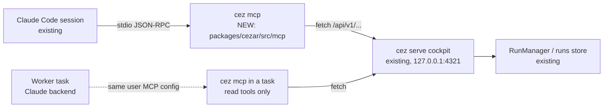

# `cez mcp` — a stdio MCP server for supervising cezar tasks from a Claude Code session

- Date: 2026-10-06
- Status: proposed (fork `sheeerth/cezar` only)
- Brief: [`briefs/2026-10-06-cez-mcp.md`](briefs/2026-10-06-cez-mcp.md)
- Related: open-mercato/cezar#1109 (upstream proposal, not coordinated with), spec `2026-09-10-dispatch.md` (`cez task`, the in-task CLI this does NOT replace)

## 📝 TLDR

A developer working in an interactive Claude Code session wants that session to supervise cezar tasks: start them (sometimes across several registered projects), wait, read status, the worker's latest output and the diff, then reply, continue or cancel until the task reaches review. Today the session can only `curl` an undocumented `/api/v1` or read `.ai/cezar/runs.json`. This spec proposes **`cez mcp`**, a new CLI subcommand that speaks MCP over stdio as a thin client of the already-running cockpit. It exposes 12 typed tools, adds no HTTP route, and serves only read tools when it runs inside a cezar task.

## 📝 Problem Statement

- **The supervision loop has no interface.** A Claude Code session that hands work to cezar has to guess request bodies (`POST /runs` has ~30 keys and an XOR refinement), poll by hand and infer what "finished" means from seven statuses plus an `activity` sub-state. Every guess costs a round trip, and fan-out across projects multiplies them.
- **`cez task` does not fit.** It needs `CEZ_API_URL`/`CEZ_PROJECT_ID`/`CEZ_TASK_ID`, which the engine injects into a task (`dispatch/task-cli.ts`), and its verbs (`create` a child, `report` to a parent) belong to a dispatch tree. An outside session has no parent run.
- **Claude Code consumes MCP natively.** A stdio server registered once in the client config gives the session schemas, hints and a server-side wait, with nothing to configure in cezar.

## 📝 Proposed Solution

A `cez mcp` subcommand in `packages/cezar/src/mcp/`, built on `@modelcontextprotocol/server` v2. It resolves the cockpit URL, then maps each MCP tool call to one or more existing `/api/v1` requests made with Node `fetch`.

**Alternatives considered (brief § Agreed direction):**
- **MCP injected into tasks in place of `cez task`.** Lost because Bash reaches every backend, while MCP would need per-backend config injection and adds no capability.
- **A skill or doc with curl examples.** The user declined it: typed tools with hints and a wait inside the server are the point, and #1109's prototype already exercised the shape.
- **Hand-rolled JSON-RPC.** Zero dependencies, but it would have to own two protocol eras: 2025-era clients use `initialize` and sessions, while 2026-07-28 is stateless.
- **Streamable HTTP at `/api/v1/mcp`.** A new network surface that needs opt-in gating and Origin-guard changes. The stdio client covers the stated use without it.

## 📝 Architecture



Takeaway: the new module is a client process. The cockpit gains no route, and the only server change is the schema de-dup in Phase 1.

**Module layout** (`packages/cezar/src/mcp/`, each file readable in one sitting):

| File | Responsibility |
|---|---|
| `index.ts` | `runMcpCommand(argv, env, io)` parses `--url` and `--read-only`, builds the server and connects `StdioServerTransport`. |
| `cockpit.ts` | URL resolution, `fetch` wrapper, error mapping to `isError` results, health probe. Never throws to the transport. |
| `projects.ts` | Default-project resolution (cwd → boot) and the `projectId` → scope-prefix helper. |
| `tools.ts` | The tool table: name, description, input schema, hints, handler. The single place a tool is defined. |
| `wait.ts` | `wait_for_runs` polling loop and the `isSettled(run)` predicate. |

**Registration:** `src/index.ts` routes `process.argv[2] === 'mcp'` before `parseArgs`, the same way it routes `task`, with a lazy `await import('./mcp/index.ts')` so normal boot never loads the SDK.

**Cockpit URL resolution:** `--url` → `CEZ_API_URL` → discovery. `cez serve` starts at 4321 and takes the first free port in 4321–4370 (`pickPort`, `src/index.ts:414`), so discovery probes `GET /api/v1/health` on `127.0.0.1:4321…4370` in parallel (300 ms timeout each) and keeps the answers that parse as `healthResponseSchema`. With one cockpit it uses that one. With several it prefers the cockpit whose `GET /api/v1/projects` contains the cwd's project, then the lowest port. No runtime file, no state. The URL is resolved on the first tool call and re-resolved after a connection failure, because a restarted cockpit may land on another port. The server always starts and answers `tools/list`, even with no cockpit, so Claude Code never marks it as failed.

**In-task restriction (security-relevant):** `cez mcp` registers only the read tools, regardless of flags, when either signal says it runs inside a cezar task: (a) `env.CEZ_TASK_ID` is set (the engine sets it for every task, `workflows/run.ts` `agentEnv`), or (b) `realpath(cwd)` lies inside a `.ai/cezar/worktrees/<id>` path segment. The second signal exists because an MCP client may spawn stdio servers with a reduced environment (the MCP TypeScript SDK's default stdio environment is a short allowlist), and whether Claude Code forwards its full env is not verified; Step 6 records the observed behavior. Reason for the filter: cezar's Claude-backend workers load the user's MCP config, and discovery (above) finds the cockpit even without `CEZ_API_URL`, which the engine passes only while dispatch is reachable (`agentEnv`). Without this filter every task agent would get `start_run`/`cancel_run` outside dispatch's engine brakes: four children in flight, and a child's budget carved from its parent's (AGENTS.md § Zero config, run 3f7eaf02). An agent inside a task keeps `cez task` for delegation. `--read-only` applies the same filter on request.

**Default project:** when a tool call omits `projectId`, the server calls `GET /api/v1/projects`. It picks the `status: 'ok'` entry with the longest `root` that equals or contains `realpath(process.cwd())`, using a path-segment-boundary match, never a string prefix. If nothing matches, it uses the boot project (`default`). The result is cached per process. A task worktree (`<root>/.ai/cezar/worktrees/<id>`) therefore resolves to its own project.

**Scoping:** every project-scoped call goes to `/api/v1/p/:projectId/…`. `default` stays the boot alias, as AGENTS.md's route-parity rule defines.

## 📝 API Contracts

No HTTP contract changes, apart from Phase 1's validator swap. The MCP tool surface:

Common rules:
- Every tool sets `readOnlyHint` and `destructiveHint` explicitly. Write tools also set `idempotentHint: false`. A unit test iterates the table and fails on any tool missing either hint.
- Every tool accepts optional `projectId: string`.
- A result is `structuredContent` plus the same JSON as one text block.
- A cockpit error (`{ error }` with 4xx), an unreachable cockpit or a timeout returns `isError: true` with one human line. No tool throws to the transport.
- Text payloads are capped at 50,000 characters per result. Truncation is stated in the result (`truncated: true` plus a hint on how to narrow).

| Tool | Input (beyond `projectId`) | Route(s) | Output (projection) | Hints |
|---|---|---|---|---|
| `list_projects` | — | `GET /projects` | `[{ id, name, status, tags, current }]`; `current` marks the resolved default | RO |
| `list_workflows` | — | `GET /p/:pid/workflows` | `[{ name, description, source }]` (the catalog has no id; `name` is what `start_run.workflow` takes) | RO |
| `list_runs` | `status?: RunStatus[]`, `limit?: 1–100` (default 30), `includeArchived?: boolean` (default false) | `GET /workspace/runs-index` filtered client-side to the project | `{ runs: [{ id, title, status, activity, createdAt, finishedAt }], truncated }` — `truncated` is carried from the index's per-project cap | RO |
| `get_run` | `runId` | `GET /p/:pid/runs/:id` | `{ id, title, status, activity, settled, needsAnswer, currentStepId, branch, tokensUsed, costUsd, pullRequestUrl, finishedAt, error }` — `needsAnswer` is `status === 'waiting' \|\| awaitingAnswerSince !== undefined`; the question text itself is read with `get_run_messages` | RO |
| `get_run_messages` | `runId`, `limit?: 1–50` (default 15) | `GET /p/:pid/runs/:id/history` from the newest page, following `olderCursor` (at most 3 pages of 100 items) until `limit` conversation items are collected | the newest `limit` conversation items (assistant/user text verbatim, tool calls as one-line summaries), oldest first, plus `asOfSeq` | RO |
| `get_diff` | `runId`, `path?: string`, `patches?: boolean` (default true) | `GET /p/:pid/runs/:id/changes` | `{ stat, files: [{ path, status, adds, dels, patch? }] }`; `path` narrows to one file | RO |
| `wait_for_runs` | `runs: [{ runId, projectId? }]` (1–8), `mode?: 'any' \| 'all'` (default `any`), `timeoutS?: 1–45` (default 40) | polls `GET /p/:pid/runs/:id` | `{ timedOut, runs: [get_run projection] }` | RO |
| `start_run` | `.pick()` of contract `createRunInputBaseSchema`: `task`, `workflow?` (defaults to `quick-task` in `tools.ts`, because the route requires exactly one of `workflow`/`steps`), `runner?`, `model?`, `agentProfile?` | `POST /p/:pid/runs` | `{ id, status }` | write |
| `send_run_message` | `runId`, `text` | `POST /p/:pid/runs/:id/messages` (contract `messageInputSchema`, text only) | the route's response | write |
| `continue_run` | `runId`, `text?` | `POST /p/:pid/runs/:id/continue` | the route's response | write |
| `cancel_run` | `runId` | `POST /p/:pid/runs/:id/cancel` | the route's response | destructive |
| `finish_run` | `runId` | `POST /p/:pid/runs/:id/finish` | the route's response | destructive |

**`settled` predicate** (`wait.ts`, exported, unit-tested over every `RunStatus`): a run is settled when `status ∈ {waiting, review, done, failed, cancelled}`, or when `status === 'running' && activity === 'monitoring'`. `queued` and plain `running` are active. Monitoring counts as settled because, without it, a wait on a parked monitor would spin until timeout on every call (AGENTS.md § Changing a mechanism, `monitoring`).

**`wait_for_runs` algorithm:** fetch every run once. Return immediately if `mode` is already satisfied. Otherwise poll every 2 s until it is satisfied or `timeoutS` elapses. One `AbortController` covers the timeout, the MCP request's cancellation signal and process shutdown. Runs in different projects are fetched in parallel per tick. A 404 on one run marks it `{ error: 'not found' }` and counts as settled, so the wait never spins on a deleted run. The 45 s cap keeps a call under the 60 s tool timeout common in MCP clients.

**Input schemas** come from `@open-mercato/cezar-contract` via `.pick()`/`.extend()`, converted to JSON Schema by the SDK's zod integration. MCP-only fields (`projectId`, `limit`, `timeoutS`, `mode`) are declared in `tools.ts`. They are not API shapes and never enter `packages/contract`.

## 📝 Data Model

No new state. `cez mcp` holds only per-process caches (resolved URL, default project, last health result) and writes nothing to `.ai/cezar/`, `~/.cezar/` or `~/.cache/cez/`. `ensureDataGitignore` is unaffected.

## 📝 UI/UX

No cockpit change. The user-facing surface is the client config entry, documented in `docs/reference.md` and in the fork's README:

```json
{ "mcpServers": { "cezar": { "command": "cez", "args": ["mcp"] } } }
```

Installation for the fork: run `npm run build` and then `npm link` in `packages/cezar`, so the global `cez` is the fork build. The currently installed npm release (0.14.0) has no `mcp` subcommand, and an unlinked `cez mcp` exits with the normal unknown-command help. Tool descriptions are written for the model: each states when to call it, and `wait_for_runs` says "call repeatedly; it returns within 45 s whether or not the run settled".

## 📝 Edge Cases & Failure Scenarios

| Scenario | Behavior |
|---|---|
| Cockpit not running | `tools/list` still works. Each call returns `isError`: "no cezar cockpit found on 127.0.0.1:4321–4370 — start it with `cez serve`" (or names the explicit `--url`/`CEZ_API_URL`). |
| Something else on 4321 | Discovery skips any port whose health body fails `healthResponseSchema`. An explicit `--url` that fails it returns `isError` "no cezar cockpit at <url>". |
| Several cockpits running | The one serving the cwd's project wins, then the lowest port. `list_projects` shows which cockpit was chosen (its URL is in the result). |
| Cockpit restarts mid-wait | A poll tick fails, gets one retry on the next tick, then the call returns `isError` with the last known states. |
| `projectId` unknown or root missing | The route's 404/409 `{ error }` is relayed as `isError`. |
| cwd in no registered project | Falls back to the boot project. `list_projects` shows which project is `current`. |
| Run is `queued` when messaged | The route stacks the message onto the queued prompt (#472). The tool relays the route's answer unchanged. |
| Dispatch-tree child started via `start_run` | Not possible: `start_run` maps to `POST /runs`, a plain top-level task, never `/dispatch`. |
| Huge diff or history | 50,000-character cap with `truncated: true`. `get_diff` takes `path` to narrow and `patches: false` for a stat-only view. |
| Inside a worker (`CEZ_TASK_ID` set, or cwd in a task worktree) | Only the 7 read tools are registered. Tests pin both signals. |
| Inside a worker that runs without a worktree AND whose client strips env | Neither signal fires; write tools are registered. Residual gap, see Risks and A8. |
| stdout pollution | Nothing but the transport writes to stdout. Diagnostics go to stderr. A test asserts that a full session's stdout parses as JSON-RPC lines. |
| Client cancels a `wait_for_runs` call | The abort signal stops the loop within one tick. No request is left in flight. |

## 📝 Risks & Impact Review

- **New server runtime dependency.** `@modelcontextprotocol/server` 2.3.1 plus `@modelcontextprotocol/core` (two packages) and `zod ^4.2`, which dedupes with the repo's `^4.4.3`. `CODE_REVIEW.md:52` makes this a review decision, so the Phase 2 commit adds both to the budget line with the reason: Node ships no MCP implementation, v1 `@modelcontextprotocol/sdk` carries ~16 runtime dependencies, and a hand-rolled server would have to track two protocol eras. The same commit corrects the line's existing drift (`dotenv`, `@clack/prompts` are runtime dependencies missing from it). Rollback means removing the subcommand and the dependency. Nothing persists.
- **Load-path isolation.** The SDK is loaded only behind the lazy import, so `cez serve` boot time and its failure modes are unchanged.
- **New CLI surface.** `cez mcp` and its flags join `BACKWARD_COMPATIBILITY.md` §1. The tool names and input schemas are a compatibility surface for MCP client configs and prompts, so they are listed there too.
- **Write capability exposure.** A stdio server runs as the local user, who could already run `curl` against the loopback API. No reach is added beyond that. The in-task filter is what keeps the capability from widening for worker agents. Its residual gap: a task with `worktree: false` (it runs in the repo root) under a client that does not forward `CEZ_TASK_ID`. Step 6 verifies Claude Code's actual env forwarding; if it strips env, the user either registers `cez mcp` at project or local scope for their own session instead of user scope (workers then never load it), or accepts the gap (A8).
- **Fork divergence.** If upstream #1109 lands, a sync will conflict in `src/mcp/` and `src/index.ts`. Tool names follow #1109's thread to minimize the conflict.
- **`POST /runs` validator swap (Phase 1).** The two schemas are field-identical today (verified in #1109's thread). A parity test posts edge-case bodies, including bounds and the XOR refinement, through the route before and after the swap.

## 📋 Phasing

1. **Phase 1: contract de-dup for `POST /runs`.** Not required by MCP (the two schemas are field-identical today), so it ships as its own PR before the MCP work; no behavior change.
2. **Phase 2: `cez mcp` with read tools.** Useful immediately: listing, status, messages and diff for tasks started in the cockpit.
3. **Phase 3: write tools and `wait_for_runs`.** Completes the supervision loop.
4. **Phase 4: packaging, docs and the fork install path.**

## 📋 Implementation Plan

### Phase 1: `POST /runs` validates the contract schema
1. **Swap the validator.** `server.ts`'s `.post('/runs', …)` validates `createRunInputSchema` from `@open-mercato/cezar-contract`. `startRunSchema` and any helper used only by it are deleted, and the comment at `server.ts:720` that names it is updated. Test: the existing `POST /runs` suites stay green, a new case in `contract-parity.runs.test.ts` posts the bound edges (`task` 100k, 4 images, variants 1–3, XOR violation), and the route's acceptance matches `createRunInputSchema.safeParse`. Verify the test goes red against a deliberately narrowed schema.

### Phase 2: `cez mcp` skeleton and read tools
2. **Dependency and routing.** Add `@modelcontextprotocol/server@2.3.1` to `packages/cezar`, update `CODE_REVIEW.md:52` (including the drift fix), and route `mcp` in `src/index.ts` with a lazy import. Test: `cez mcp --help` prints usage, no static import of `@modelcontextprotocol/*` exists outside `src/mcp/` (a grep test over `src/`), and a subprocess `cez --help` started with a `--import` loader hook that records resolved specifiers reports no `@modelcontextprotocol` module, and `check:pack` passes.
3. **Cockpit client.** `cockpit.ts` handles URL resolution, the health probe with schema validation, and error mapping. Test: unit tests with an injected `fetch` cover resolution order, the unavailable and non-cezar cases, and 4xx → `isError`.
4. **Project resolution.** `projects.ts` matches by cwd with path-segment boundaries and falls back to boot; `cockpit.ts` discovery covers the 4321–4370 scan. Test: discovery with zero, one and two fake cockpits plus a non-cezar responder; nested roots (longest match wins), a sibling prefix (`/a/repo` vs `/a/repo-2`), a worktree path, and the no-match fallback.
5. **Read tools.** `list_projects`, `list_workflows`, `list_runs`, `get_run`, `get_run_messages` and `get_diff`, with projections and the 50k cap. Test: each tool runs against a fake cockpit. The hints test iterates the table. The stdout-purity test runs an in-memory client session.
6. **In-task and `--read-only` filter.** Test: with `CEZ_TASK_ID` set, with cwd inside `.ai/cezar/worktrees/<id>`, and with `--read-only`, `tools/list` returns exactly the read set; `CEZ_DISPATCH=0` (no `CEZ_API_URL`) does not change that. Verify the test fails with the filter removed. Manual check recorded in the PR: register `cez mcp` in Claude Code, log `process.env.CEZ_TASK_ID` presence from a task run, and state whether Claude Code forwards env to stdio servers.

### Phase 3: write tools and waiting
7. **`settled` predicate and `wait_for_runs`.** Test: the predicate is checked over every `RunStatus` × `activity`. The loop runs on fake timers for `any`/`all`, timeout, a 404 run, cancellation mid-wait and a restart mid-wait.
8. **Write tools.** `start_run`, `send_run_message`, `continue_run`, `cancel_run` and `finish_run`, with input schemas picked from the contract. Test: for each tool, a body built from its advertised `inputSchema` — including the minimal `start_run` body `{ task }` — is accepted by the real route (an in-process `createApp` with `CEZ_DRY_RUN=1`), and a 409 is relayed as `isError`.

### Phase 4: packaging and docs
9. **Package smoke.** `packages/cezar/test/e2e/` packs the tarball and runs `cez mcp` over stdio against a `CEZ_DRY_RUN=1` cockpit: `initialize`, `tools/list`, `get_run` on a started dry run, and `start_run` → `wait_for_runs` → `get_diff`. Test: `npm run test:package` is green.
10. **Docs.** `docs/reference.md` gets the subcommand, flags, client config snippet and tool table. `BACKWARD_COMPATIBILITY.md` §1 gets `cez mcp`, its flags and the tool names. The fork's README gets the `npm link` install path. Test: none; this is a docs-only step and the review checks it.

Each step leaves `npm run typecheck && npm test && npm run test:unit && npm run build` green. Step 9 adds `test:package`.

## Resolved assumptions (autonomous defaults)

The brief's Resolved-unknowns table answered transport, discovery, the no-cockpit case, the dependency, destructive tools, the in-task filter, the default project, installation, the schema de-dup and naming. The questions below were open after it:

| # | Question | Default applied | Rationale |
|---|---|---|---|
| A1 | `get_diff` from `GET /runs/:id/diff` (as the brief listed) or `/runs/:id/changes`? | `/runs/:id/changes` | AGENTS.md § Git requires every task-diff surface to resolve through the task-base logic (`taskBranch` + `runStartedAt`, #591/#751). `/diff` keeps the whole-branch anchor and returns plain text. `/changes` is structured and allows per-file narrowing. |
| A2 | Exact meaning of "settled" for `wait_for_runs`? | `waiting`, `review`, `done`, `failed`, `cancelled`, or `running` + `activity: monitoring` | `waiting` is "needs you", monitoring is parked and the rest are terminal. Leaving out monitoring makes a wait spin on parked runs. |
| A3 | Which `POST /runs` fields does `start_run` expose? | `task`, `workflow`, `runner`, `model`, `agentProfile` (picked from the contract) | Smallest surface for the loop. Images, variants, system prompt, `worktree` and `autonomous` keep their route defaults and can be added later without breaking callers. |
| A4 | Attachments on `send_run_message`/`continue_run`? | Text only | Claude Code tool calls carry text naturally. Images can be added later. |
| A5 | Response size bound? | 50,000 characters per result, `truncated` flag, narrowing hints | Keeps one call from flooding the supervising session's context. Reversible constant. |
| A6 | `--header` / hosted-cockpit auth from #1109? | Not included | The brief targets a loopback cockpit. A reverse-proxied cockpit is out of scope. |
| A7 | `list_runs` source? | `GET /workspace/runs-index` filtered to the project, archived runs hidden by default, `truncated` carried through | Already slim and cross-project. No new route. |
| A8 | In-task detection when the client strips env and the task has no worktree? | Two signals (`CEZ_TASK_ID`, worktree cwd); the remaining gap is documented, not closed | Closing it needs a cockpit-side identity check this spec does not add. ⚠ NEEDS HUMAN CONFIRMATION — accept the residual gap, or require the env-forwarding check of Step 6 to pass before Phase 3's write tools ship. |
| A9 | Cockpit discovery (the brief assumed a fixed port 4321) | Parallel health probe of 4321–4370, schema-validated, cwd-project preference | `cez serve` moves off 4321 when it is taken (`pickPort`); a fixed default would report a running cockpit as missing. |

A8 carries `⚠ NEEDS HUMAN CONFIRMATION`; the others are reversible without a migration and none widens exposure.
