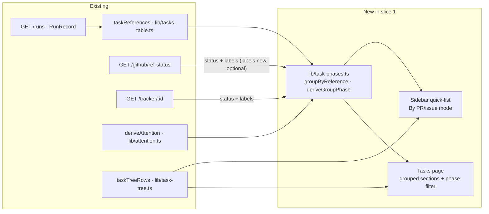
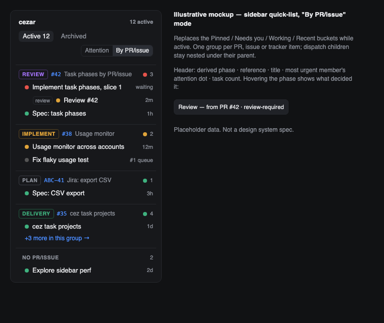
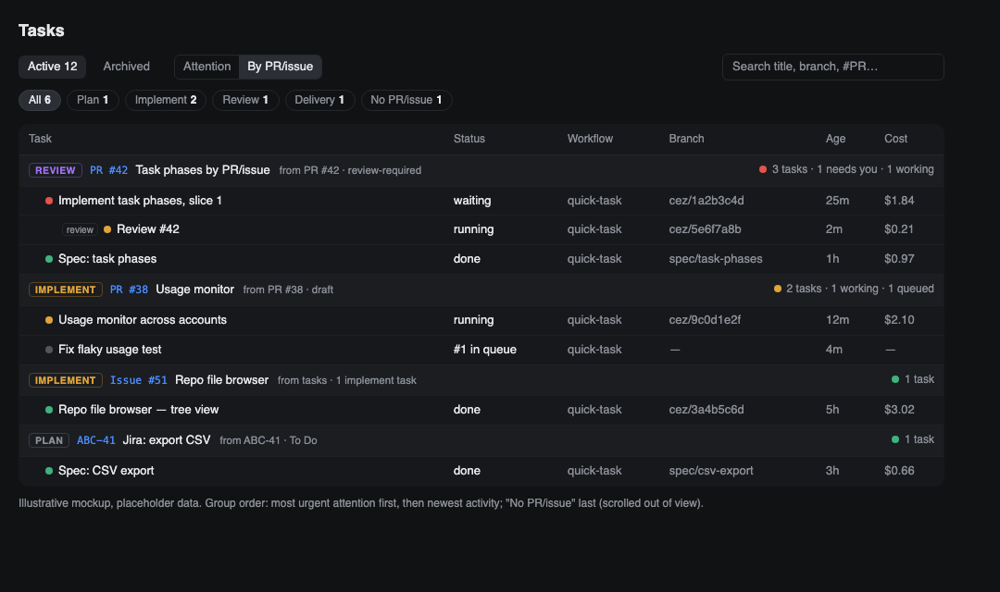

# Task list grouped by PR/issue with a derived SDLC phase per group (task phases, slice 1)

- Date: 2026-10-07
- Status: proposed
- Brief: [`briefs/2026-10-07-task-phases-by-pr-issue.md`](briefs/2026-10-07-task-phases-by-pr-issue.md)
- Target: fork `sheeerth/cezar` only — nothing from this work is published to `open-mercato/cezar`.

## 📝 TLDR

The user supervises many parallel cezar tasks, often several per pull request or issue (spec,
implementation, review, fixes), and today the task list scatters one PR's tasks across the
attention buckets (Pinned / Needs you / Working / Recent) with no notion of where that piece of
work stands. **Proposed:** a "By PR/issue" mode for the task list that replaces the buckets while
active, puts each task (with its dispatch subtree and variants) into exactly one group keyed by
its first PR, else its first issue, and shows a **derived** SDLC phase per group — plan,
implement, review or delivery — computed from data cezar already has: the PR's reference status,
the group's task statuses and workflows, and tracker status/labels through the provider-neutral
seam. No phase is stored server-side, nothing is written to any tracker, and nothing is
configurable in v1.

## 📝 Resolved assumptions (autonomous defaults)

The brief's Resolved-unknowns table answers the product questions (unit = the PR/issue, fixed
phase values, derived only, provider-neutral, never write back, no config, no MCP exposure in this
slice). These are the questions it left open, answered with the most reversible default:

| # | Question | Applied default | Why | Confirm? |
|---|----------|-----------------|-----|----------|
| A1 | Which surfaces get the mode? | The sidebar quick-list (where the attention buckets live) **and** the per-project Tasks page, sharing one mode value. The cross-project global Tasks page is out of scope. | Buckets exist only in the sidebar; the Tasks page is where there is room for group headers, counts and the phase filter. One shared mode, like the existing Active/Archived `ListView`, keeps the two from disagreeing. | reversible |
| A2 | Does the mode survive a reload? | Yes — persisted in `localStorage` (as `lib/sidebar-collapse.ts` does). The **phase filter** does not: in-memory, reset to "All" on reload. | Grouping hides no task; a filter that silently survives a restart hides tasks the user does not know are hidden — the reason `ListView` is in-memory (`components/list-view.tsx`). | reversible |
| A3 | Where is the group/phase computed, and does the phase enum go into the contract? | Client-side, in a pure, Node-free `packages/web/src/lib/task-phases.ts`, on top of the existing `taskReferences()` rule. The phase enum and group-key type live **in that module** until a route carries them (slice 2's stored phase, or phase in `cez mcp` after fork PR #8) — then they move to `packages/contract` as zod schemas. No new route in slice 1. | The reference rule (#407, #526, #945) already lives client-side and `runIndexEntrySchema`'s comment forbids a second server-side copy. AGENTS.md defines the contract as HTTP shapes, and nothing in slice 1 sends a phase over HTTP. | reversible |
| A4 | How does a Jira/Linear task join a group when runs carry only GitHub numbers? | Expose the tracker provenance runs **already persist** (`automationTracker.{provider,key,url}`, server-only today) on the wire as a display-only `trackerRef`. A group key falls back PR → GitHub issue → tracker item. Tasks started by hand from the Tracker tab carry no such record and land in "No PR/issue" in this slice. | Honours the brief's "no new persisted state". Recording a tracker ref for hand-launched tasks needs a new persisted field and a `POST /runs` input — named as the first follow-up instead of slipped in here. | reversible |
| A5 | Where do GitHub labels come from? | The batched `GET /github/ref-status` query adds `labels(first: 20) { nodes { name } }` on the node it already fetches, answered as an optional `labels` map. | Same GraphQL node, no extra request; optional on the wire, so an older server simply omits it. | reversible |
| A6 | Where do Jira/Linear status and labels come from, and is that new network traffic acceptable by default? | The existing `GET /tracker/:id` read, one cached query per distinct `trackerRef` key in the list, capped at 20 per project, sent with `expectedScope` so a ref from another source or connection is refused (`source_changed`) rather than read. It runs **only when the project has a tracker connection configured** (the user's explicit act in Settings), with `staleTime` 10 min, no polling and no refetch on focus. Any failure is "no tracker signal", never an error. | The provider-neutral seam (`trackerItemSchema.status`/`labels`) is the only way the brief's Jira/Linear requirement is met. AGENTS.md § Zero config asks that features widening network use be opt-in behind a `CEZ_*` flag. This default treats a configured connection as that opt-in instead of adding a flag. Owner-confirmed (2026-10-07): a configured connection is the opt-in; no `CEZ_*` flag. | ✅ confirmed by owner |
| A7 | What decides "plan" from tasks, with no tags on tasks? | A fixed in-code hint list (`spec`, `plan`, `brainstorm`, `design`, `shape`) matched against the workflow name, the step skill names and the task prompt's leading `/skill`; dispatch `kind: implement`/`review` map directly. | No config in v1 (brief); the list is small, tested as a table, and easy to widen once a week of use shows misses. | reversible |
| A8 | Does a forge PR closed without merging, or a GitHub issue closed as not-planned, set a phase? | No — it yields no layer-1 signal and the next layer decides. (Tracker *status* words are layer 2 and have their own vocabulary below.) | The brief fixes four phases; inventing "abandoned" would be a fifth. | reversible |
| A9 | Which tasks feed a group's task-layer signals — the visible view or all of them? | **All** tasks of the group, active and archived alike; the Active/Archived view only decides which rows are painted. | A PR's phase must not change with the tab the user is on; the plan-only override in layer 1 reads the same set. | reversible |

A6 was confirmed by the owner on 2026-10-07: a configured tracker connection is the opt-in for
the tracker reads, and no `CEZ_*` flag is added. The other answers weaken neither security nor
data scoping, and each one is a code-local choice that touches no compatibility surface beyond
additive optional fields.

## 📝 Problem Statement

- Today `groupRuns()` (`packages/web/src/lib/task-groups.ts`) buckets by attention. A PR that has a
  spec task in Recent, an implementation in Working and a review waiting on the user appears in
  three places, and nothing on screen says "this PR is in review".
- The per-project Tasks page (`routes/tasks-overview.tsx`) is a flat table sorted by status
  weight; it can search by PR/issue number (fork PR #3) but not show a PR's tasks together.
- No phase exists anywhere: not on runs, not on projects, not in the contract. The signals that
  imply one do exist — PR reference status (`referenceStatusSchema`), task status and dispatch
  kind, tracker item `status`/`labels` — but no surface combines them.
- The user's question when scanning the list is "what do I handle now, and what is waiting?" —
  answered per piece of work (the PR/issue), not per task.

## 📝 Proposed Solution

A second **grouping mode** for the existing task lists, `byReference`, toggled next to the
Active/Archived tabs. In that mode the list renders **reference groups** instead of attention
buckets:

1. **Group key** — for every root task (a task with no `dispatch.parentRunId`, variants collapsed
   as today), the first entry of `taskReferences(run, repoBase)` (PRs strongest-first, then
   issues), else the run's `trackerRef`. A root with no reference inherits the first reference
   found depth-first in its dispatch subtree. The whole subtree joins the root's group; children
   still nest under their parent (`lib/task-tree.ts`). A variant tile (`groupId`) uses the first
   member, by variant letter, that has a reference. No reference anywhere → the **No PR/issue**
   group, which has no phase.
   **Stability:** the key is a function of the run records only — never of a reference status,
   a label or a tracker answer — so status refreshes never regroup anything. It *does* change
   when the records change: a task (or a child in its subtree) declaring its first `CEZ:PR`, or
   opening a PR, moves its subtree out of "No PR/issue" or from its issue group into the PR
   group. That move is the intended reading of "first PR, else first issue".
2. **Derived phase** — `deriveGroupPhase(signals)` returns `{ phase, source }`, where `source`
   names the signal that decided it ("PR #12 · review-required", "ABC-41 · In Progress",
   "label `review`", "1 task in review"). The tooltip shows `source`, which is what lets the user
   (and the supervisor in conversation) compare the derived phase against their own reading
   during the week of use the brief schedules before slice 2.
3. **Group header** — phase badge, the reference chip (linking to the forge/tracker), the group
   title (the root task's title when the key is a tracker ref; the reference otherwise), the
   most urgent member's attention dot (`deriveAttention`, lowest `ATTENTION_RANK`), and counts
   (tasks, needs-you, working).
4. **Phase filter** — a chip row (All · Plan · Implement · Review · Delivery · No PR/issue, each
   with a count) above the groups. Filters groups, never individual tasks.

### Phase rules (fixed, zero-config)

Evaluated in layers; the first layer that yields a phase wins. Vocabulary matching is
case-insensitive on whole words after normalising `-`/`_` to spaces. Inside layer 2 the sources
are read **in order** — (a) labels on the key PR/issue, (b) the tracker item's `status`, (c) the
tracker item's `labels` — and the first source that matches anything decides; when one source
matches several words (labels `review` and `qa` together), the most advanced phase wins
(delivery > review > implement > plan). The tracker item is the `trackerRef` of the newest
group member that carries one. Task-layer inputs (layer 3 and the plan-only override) read
**every** member of the group, whatever the Active/Archived view (A9).

| Layer | Signal | → phase |
|-------|--------|---------|
| 1. Forge state of the key (PR) | `merged`, `ready` | delivery |
| | `review-required`, `changes-requested`, `checks-pending`, `checks-failing` | review — **except** a plan-only group (every task plan-kind) with an open PR → plan |
| | `draft` | implement (plan-only group → plan) |
| | `closed` | no signal |
| 1. Forge state of the key (issue) | `completed` | delivery |
| | `open`, `not-planned` | no signal |
| 2. (a) key labels → (b) tracker status → (c) tracker labels | `merge queue`, `qa`, `qa approved`, `done`, `released`, `deployed`, `shipped`, `resolved` | delivery |
| | `review`, `in review`, `code review`, `changes requested` | review |
| | `in progress`, `in development`, `doing`, `wip`, `implementing` | implement |
| | `backlog`, `todo`, `to do`, `triage`, `spec`, `needs spec`, `design`, `planning`, `refinement` | plan |
| 3. Tasks in the group (all members) | any task in cezar's `review` status, or a running dispatch child of `kind: review` | review |
| | any task that is not plan-kind | implement |
| | only plan-kind tasks | plan |

Layer 1 wins over labels because it is the freshest fact cezar has about the PR (the reference
status is already ranked for freshness in `derivePrReferenceStatus`). Labels win over tasks
because a label is a human statement about the work, and tasks are cezar's own activity.

### Alternatives considered

- **Server-side derivation in `GET /workspace/runs-index`** — rejected for slice 1: it would
  duplicate the client-side reference rule `runIndexEntrySchema` explicitly refuses to duplicate,
  and the per-project lists do not read that route. Revisit when MCP exposure (after fork PR #8)
  needs the phase server-side; the pure module is written Node-free so it can move.
- **Grouping inside each attention bucket** — rejected in the brief (one PR in two places).
- **A configurable label/status → phase map** — rejected in the brief for v1.

### Market check

GitHub Projects and Linear derive board columns from issue/PR state plus a status field, and
Jira from a workflow status category. All three let the user configure the mapping; all three
lose the agent-task context cezar has. This spec takes their default mapping shape (state first,
then status/labels) and skips the configuration until a week of use shows the defaults wrong.

## 📝 Architecture



Takeaway: everything new is a pure cockpit module plus two list renderings; the server changes
are two additive optional fields on existing answers.

- **Primary module:** `packages/web/src/lib/task-phases.ts` — pure, React-free, Node-free:
  `groupKeyOf`, `groupByReference(runs, view, lookups)`, `deriveGroupPhase(signals)`,
  `groupAttention(members)`, `filterGroupsByPhase`. Built on `taskReferences`, `sortRuns`,
  `queuePositions`, `taskTreeRows`, `deriveAttention` — no second copy of any of those rules.
- **Mode state:** `components/list-view.tsx` grows a sibling context `useListGrouping()`
  (`'attention' | 'byReference'`), persisted under one `localStorage` key, read by both lists.
- **Signals:** `useReferenceStatuses` (already batched per project) supplies status and, after
  this slice, labels; a new `useTrackerItemSignals(refs)` wraps `GET /tracker/:id` per distinct
  key, gated as A6 says (configured connection only, `expectedScope`, `staleTime` 10 min, no
  polling, no focus refetch).
- **Server:** `refStatusQuery` adds `labels(first: 20) { nodes { name } }` on both arms of
  `issueOrPullRequest`; the route answers them in an optional `labels` map. The run routes
  project `automationTracker` into a display-only `trackerRef`. No new route.
- **Current consumers unaffected:** with the mode at its default (`attention`) every list renders
  exactly as today; the `ref-status` and run answers only gain optional keys.
- **Future dependency:** slice 2 (stored phase, `set_phase`, dropdown) and phase in `cez mcp`
  `get_run`/`list_runs` (after fork PR #8 merges) promote `TaskPhase` and `TaskGroupKey` to
  zod schemas in `packages/contract` at the moment a route first carries them (A3).

## 📝 Data Model

No new server-side state: `runs.json`, the NDJSON event files, `.ai/cezar/` and `~/.cezar/` are
untouched. The only new persisted state is browser-side — one `localStorage` key,
`cez.taskList.grouping` (`'attention' | 'byReference'`), absent or unrecognised = `attention`.

Cockpit types (`packages/web/src/lib/task-phases.ts`; not on the wire in slice 1):

```ts
export const TASK_PHASES = ['plan', 'implement', 'review', 'delivery'] as const;
export type TaskPhase = (typeof TASK_PHASES)[number];

export type TaskGroupKey =
  | { kind: 'pr'; number: number }
  | { kind: 'issue'; number: number }
  | { kind: 'tracker'; provider: 'jira' | 'linear'; key: string };

export interface ReferenceGroup<T> {
  key: TaskGroupKey | null;        // null = "No PR/issue"
  phase: TaskPhase | null;         // null only for the "No PR/issue" group
  source: string;                  // what decided the phase, for the tooltip
  rows: QuickListRow[];            // existing row type: runs and variant tiles
  attention: Attention;            // most urgent member
  counts: { tasks: number; needsYou: number; working: number };
}
```

`TaskPhase` has no `none` member: the "No PR/issue" group carries `phase: null` rather than a
fifth value, so slice 2's stored phase can never be set to "none".

New contract schema (`packages/contract/src/runs.ts`, Phase 4 — it is on the wire):

```ts
/** Display-only tracker provenance, projected from the persisted `automationTracker`. */
export const runTrackerRefSchema = z.object({
  provider: z.enum(['jira', 'linear']),
  key: z.string(),
  url: z.string().url(),
});
```

## 📝 API Contracts

Two additive, optional fields on existing answers. No new route, no request-shape change.

| Route | Change | Schema |
|-------|--------|--------|
| `GET /api/v1/github/ref-status` (and `/p/:projectId/…`) | `available: true` arm gains `labels: z.record(z.number(), z.array(z.string()).max(20)).optional()` — label names for every PR/issue in the batch that has any; absent = no labels known. Same record-keyed-by-number shape as the sibling `prs`/`issues` maps, which `contract-parity` already checks. | `githubRefStatusDataSchema` in `packages/contract/src/github.ts` |
| `GET /api/v1/runs`, `GET /runs/:id`, `GET /workspace/runs-index` | Runs gain optional `trackerRef` (above), present only when the record carries `automationTracker`. | `runRecordSchema`, `runIndexEntrySchema` in `packages/contract/src/runs.ts` |

Both follow AGENTS.md § HTTP API: schema first, the key spread conditionally so `undefined`
never reaches the wire, and `contract-parity*.test.ts` extended in both directions.
`BACKWARD_COMPATIBILITY.md` §2 needs no new route inventory; the two fields are additive on
listed routes and are noted there.

## 📝 UI/UX

Prototype: `.ai/specs/assets/task-phases-by-pr-issue/` — static, illustrative mockups with
placeholder data (no current-app screenshots: see the PR's validation notes).





- **Toggle.** A two-option segmented control ("Attention" · "By PR/issue") beside the
  Active/Archived tabs, in both the sidebar quick-list and the Tasks page header. Keyboard:
  standard radio-group arrows; `aria-pressed` on the active option.
- **Group header.** `[phase badge] [#123 chip] title · counts · attention dot`. Phase badge uses
  four neutral-but-distinct tones (plan: soft, implement: pending, review: violet, delivery:
  success) and always carries the word, never colour alone. Tooltip / `title`: the phase
  `source`. Clicking the header collapses the group (in-memory).
- **Rows.** Unchanged row components, including dispatch nesting and variant tiles; the row's
  own reference chip stays (a child can reference a second PR).
- **Order.** Groups by most urgent member attention, then by newest member activity; "No
  PR/issue" always last.
- **Sidebar cap.** The per-project 10-row cap counts rows across groups; a group cut short shows
  "+k more" linking to the project's Tasks page (from Phase 3 on, the Tasks page opens in the
  same mode because the mode is shared). Pinned tasks keep their pin icon but no
  separate Pinned bucket exists in this mode — the pin still sorts them first within their group.
- **Phase filter.** Tasks page only (the sidebar has no room): chip row with counts; an empty
  result says "No PR/issue groups in Review" with a Clear action.
- **Loading.** Until reference statuses arrive, groups render with the task-layer phase and a
  muted badge; the badge settles when the forge answers (no re-grouping: the key never depends
  on status).

## 📝 Edge Cases & Failure Scenarios

| Scenario | What the user sees |
|----------|-------------------|
| `gh` missing / offline / not GitHub | `ref-status` answers `available: false`; phases come from labels-less tracker and task layers; tooltip says "from tasks". |
| Tracker not configured, unauthorized, rate-limited, or the run's tracker ref is from another source | No tracker signal; no error toast (the tracker tab already reports connection problems). |
| A task references two PRs (reviewed #530, created #533) | It joins the group of the first in `taskReferences` order — the PR it created; the row's chips still show both. |
| A root without a reference dispatched a child that opened a PR | The whole subtree joins the child's PR group (depth-first inheritance). |
| Two roots of one variant group reference different PRs | The tile joins the first member's (by letter) group. |
| A PR's status flips from `review-required` to `merged` while viewing | The group's badge changes in place on the next ref-status refresh; membership is unaffected (keys never read status). |
| A task in "No PR/issue" opens a PR, or a child in its subtree declares `CEZ:PR` | Its whole subtree moves into that PR's group on the next run update — the intended "first PR, else first issue" reading. |
| Forge says the number is an issue but the task stored it as a PR | Key stays `pr` (stored kind); the status lookup already files under the real kind and the rule reads whichever arm answered. |
| Hundreds of tasks | Grouping is O(n) over the already-loaded list; tracker reads capped at 20 keys per project. |
| Labels contain both `review` and `qa` | Delivery wins: within layer 2, delivery > review > implement > plan. |

## 📝 Risks & Impact Review

- **Wrong defaults.** The phase is a heuristic; the brief accepts that and schedules a week of
  use before deciding on slice 2. `source` on every badge is the mitigation: a wrong phase is
  explainable on sight.
- **Network use (A6, owner-confirmed).** Phase 4's tracker reads are new automatic requests to
  a vendor the user connected, bounded (20 keys per project, 10-minute cache, no polling). The
  owner ratified (2026-10-07) that configuring the connection is the opt-in AGENTS.md § Zero
  config asks for. Phases 1–3 and Step 8 add no request at all.
- **Hard to reverse:** only the two optional wire fields and the `localStorage` key. Rollback is
  deleting the mode toggle; old servers and old cockpits keep working because both fields are
  optional and ignored when absent.
- **Fork divergence.** Upstream open-mercato/cezar#1277 (Kanban, unpublished) may pick other phase
  names; when syncing the fork, `TASK_PHASES` in `lib/task-phases.ts` is the single place to reconcile.
- **Overlap with fork PR #3** (Tasks page filters, `routes/tasks-overview.tsx`): Phase 3 below
  touches the same file. Rebase onto #3 if it merges first; the phase filter reuses its facet
  pattern rather than inventing another.
- **Repository rules:** no config key and no new `CEZ_*` variable.

## 📋 Phasing

Two pull requests, because they carry different risk:

- **PR A — the view (Phases 1–3).** Cockpit-only: no server, contract or network change. Phase
  comes from the forge status `useReferenceStatuses` already fetches and from the tasks.
  - **Phase 1 — model.** Pure grouping/phase module; nothing rendered. No visible change.
  - **Phase 2 — sidebar mode.** Toggle + grouped quick-list.
  - **Phase 3 — Tasks page mode + phase filter.**
- **PR B — richer signals (Phase 4).** GitHub labels on `ref-status` (no extra request), the
  `trackerRef` projection, and tracker item reads (A6, owner-confirmed). Only
  sharpens phases PR A already shows; can wait for, or be cut by, the week-of-use decision.

Each phase leaves the app working; the default mode (`attention`) is unchanged throughout.

## 📋 Implementation Plan

Every step ends with the repository gate (`npm run typecheck`, `npm test`, `npm run test:unit`;
`npm run build` and `npm run test:package` before each PR), and each PR runs `npm run test:e2e`
for the lists it touches.

### Phase 1 — model (PR A)

1. Add `packages/web/src/lib/task-phases.ts` with `TASK_PHASES`, `TaskGroupKey`,
   `groupKeyOf(run, tree, repoBase)` and `isPlanKind(run)` (hint list A7). Test
   (`lib/task-phases.test.ts`): key from each reference source in `taskReferences` order;
   depth-first inheritance from a child; variant tile takes the first lettered member with a
   reference; no reference → `null`; the key is identical whatever reference statuses are
   passed; adding a `CEZ:PR` to a child moves the subtree (the intended transition).
2. Add `deriveGroupPhase(signals)` (layers 1–3, layer-2 source order and in-source
   precedence). Test: a table over every `referenceStatusSchema` value; plan-only override
   computed from all members (same answer in Active and Archived); `review` + `qa` labels →
   delivery; empty input → task layer; no members and no key → `null`.
3. Add `groupByReference(runs, view, lookups)` (members in `sortRuns` order, variant tiles via
   the `QuickListRow` shape, `groupAttention`, counts, group order, "No PR/issue" last) and
   `filterGroupsByPhase`. Test: subtree stays together, rows obey the view filter while phase
   inputs do not, ordering by attention then recency.

### Phase 2 — sidebar mode (PR A)

4. Add `useListGrouping()` beside `useListView()` in `components/list-view.tsx`, persisted under
   `cez.taskList.grouping`. Test (`components/list-view.test.tsx`): default `attention`,
   persistence across remount, corrupt/unknown value → `attention`.
5. Render the toggle and the grouped list in `components/task-quick-list.tsx` and
   `components/project-groups.tsx`; feed `useReferenceStatuses` with the group keys; row cap
   across groups with "+k more" linking to the project's Tasks page. Test
   (`task-quick-list.test.tsx`, `project-groups.test.tsx`): header content, attention dot, phase
   tooltip `source`, cap and "+k more", keyboard toggle; and the existing bucket assertions in
   those files pass unchanged with the default mode.

### Phase 3 — Tasks page mode and phase filter (PR A)

6. Group sections in `routes/tasks-overview.tsx` (table and `<md` cards) under the shared mode.
   Test (`routes/tasks-overview.test.tsx`): rows grouped, attention-mode table unchanged. If fork
   PR #3 has merged first, also assert selection/bulk actions act on the visible grouped rows;
   if not, rebase this step onto whichever lands second.
7. Phase filter chip row with counts and empty state, in-memory. Test: filtering, counts,
   Clear, filter reset on remount while the mode persists.

### Phase 4 — richer signals (PR B)

8. Ref-status labels: `labels(first: 20) { nodes { name } }` in `refStatusQuery` (both arms),
   parsed in `server/forge/github.ts`, answered as the optional `labels` map; extend
   `githubRefStatusDataSchema` and `contract-parity` tests; feed layer 2 (a). Test: parser
   fixture with labels; a payload without labels behaves exactly as before.
9. `runTrackerRefSchema` in `packages/contract/src/runs.ts`; the run routes and the runs index
   spread `trackerRef` from `automationTracker` conditionally; `groupKeyOf` falls back to it
   after GitHub references. Test: parity in both directions; a record without
   `automationTracker` emits no `trackerRef` key.
10. `useTrackerItemSignals` over `GET /tracker/:id`, gated per A6: only with a configured
    connection, `expectedScope` set to
    the association's `trackerReadScope`, cap 20 keys per project. Test: `not_configured`,
    `unauthorized`, `rate_limited` and `source_changed` answers → no signal and no throw; no
    request is made without a connection.

Follow-ups (not in this spec): record a `trackerRef` for tasks hand-launched from the Tracker tab
(needs a persisted field and a `POST /runs` input); phase in `cez mcp` tools after fork PR #8;
slice 2 on a go after a week of use.
